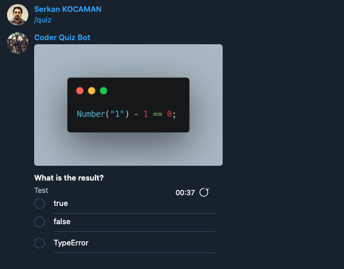

# Coder Quiz Telegram Bot ###
This bot asks you questions about coding. Bot: [t.me/CoderQuizBot](t.me/CoderQuizBot)

### Commands

/quiz : Send quiz.

/results: Send top five scorer.

Question folder structure;

- quiz
|--langName
|--|--questionName
|--|--conf.json
|--|--code

langName is available; javascript, python, rust
questionName is keyword for question.
You don't need create a png file. Bot automatically create code.png file.

### config.json structure

```
{
    "name": "typeof_string",
    "question": "What is the result?",
    "options": [
        "true",
        "false",
        "TypeError"
    ],
    "correctAnserId": 0,
    "lang": "en",
    "level": "low"
}
```
name: Unique question name.
question: is question :)
options: question option string array.
correctAnswerId: Options array index number for correct answer.
lang: Natural language key code.
level: Question level. Available values; low, mid, high



You can send a pull request to add a new question.

Serkan KOCAMAN aka KiPSOFT